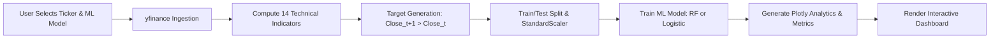

# 📈 Stock Market Classifier & Analytics Platform (`StockSenseML`)

[](https://github.com/Rithan7/stock-sense-ML)
[](https://www.python.org/)
[](https://flask.palletsprojects.com/)
[](https://scikit-learn.org/)
[](https://plotly.com/)
[](LICENSE)

An end-to-end Machine Learning web application built with **Flask**, **yfinance**, **Scikit-Learn**, and **Plotly** to predict stock market directional movement (Up vs. Down) using 14 quantitative technical indicators, rigorous feature engineering, and interactive analytics dashboards.

---

## ✨ Features & Capabilities

- 🔍 **Real-Time Market Data Ingestion**: Integration with `yfinance` to fetch OHLCV (Open, High, Low, Close, Volume) historical prices.
- 📊 **14 Quantitative Technical Indicators**:
  - **Moving Averages**: 5-day (MA5), 10-day (MA10), 20-day (MA20), and MA Crossover Trend Signals.
  - **Momentum & Trend**: Relative Strength Index (RSI 14), Moving Average Convergence Divergence (MACD & Signal Line), 5-day Price Momentum.
  - **Volatility & Bands**: Bollinger Bands Width & Relative Position, Historical 5-day Return Volatility, Normalized Price Range.
- 🤖 **Dual Machine Learning Classification Algorithms**:
  - **Random Forest Classifier**: Non-linear ensemble model with 100 decision trees and automated Gini feature importance extraction.
  - **Logistic Regression**: Probabilistic linear classifier standardized with `StandardScaler`.
  - **Automated Threshold Tuning**: Evaluates decision thresholds from 0.05 to 0.95 to maximize F1-score.
- 📈 **Interactive Plotly Analytics Visualizations**:
  - Financial Candlestick charts overlaid with Moving Averages & Bollinger Bands.
  - RSI momentum oscillator and MACD signal crossover subplots.
  - Confusion Matrix heatmaps & ROC (Receiver Operating Characteristic) curves.
  - Feature Importance ranking bar charts for Random Forest models.
- 🔐 **User Authentication & Personal Workbench**:
  - User registration & login system secured via `Flask-Bcrypt` (password hashing) and `Flask-Login` (session state management).
  - Saved Prediction History tracking prediction targets, confidence probabilities, F1-scores, and model parameters.
  - Custom stock Watchlist for tracking favorite market symbols.

---

## 🌐 Demonstration Walkthrough

Below is an overview of how the StockSenseML platform operates:



### Key Application Screens:
1. **Prediction Dashboard (`/`)**: Main workbench to select tickers, select algorithms, trigger model training, and view performance metrics & Plotly charts.
2. **Stock Search (`/search`)**: Dedicated real-time lookup tool to inspect technical indicators, prices, and technical signals for any custom stock symbol.
3. **Prediction History (`/history`)**: User dashboard displaying saved predictions, probability outputs, F1 score logs, and stock watchlist.
4. **Authentication (`/login` & `/register`)**: Secure access control for managing personalized prediction history and watchlists.

---

## 🛠️ Technology Stack

| Component | Technology | Description |
| :--- | :--- | :--- |
| **Backend Framework** | **Flask 3.0** | Python web application routing, templating, and API endpoints |
| **Machine Learning** | **Scikit-Learn** | Random Forest Classifier, Logistic Regression, `StandardScaler`, ROC/AUC, Confusion Matrix |
| **Data Ingestion & Processing** | **yfinance & Pandas** | Live market data ingestion, OHLCV processing, vector operations |
| **Interactive Visualization** | **Plotly.js** | Client-side interactive candlestick charts, subplots, ROC curves, heatmaps |
| **Database & ORM** | **SQLite & Flask-SQLAlchemy** | Relational storage for users, saved prediction history, and watchlists |
| **Security & Auth** | **Flask-Bcrypt & Flask-Login** | Password hashing (bcrypt) and session authentication management |

---

## 🔬 Mathematical Feature Engineering & Quantitative Modeling

The core predictive architecture processes raw daily OHLCV price series $\{P_t, H_t, L_t, O_t, V_t\}$ to construct 14 quantitative features and 1 binary classification target.

### 1. Binary Target Formulation ($Y_t$)
The predictive task is framed as next-session directional class estimation:
$$Y_t = \mathbb{I}(P_{t+1} > P_t) = \begin{cases} 1, & \text{if } P_{t+1} > P_t \quad (\text{Up / Bullish}) \\ 0, & \text{if } P_{t+1} \le P_t \quad (\text{Down / Bearish}) \end{cases}$$
where $P_t$ denotes the adjusted closing price at daily index $t$, and $\mathbb{I}(\cdot)$ is the indicator function.

---

### 2. Complete Technical Feature Definitions

#### 1. Daily Percentage Return ($R_t$)
Quantifies single-period relative price gain or loss:
$$R_t = \frac{P_t - P_{t-1}}{P_{t-1}}$$

#### 2. Simple Moving Averages ($\text{MA}_{N,t}$)
Computes unweighted rolling mean over lookback windows $N \in \{5, 10, 20\}$:
$$\text{MA}_{N,t} = \frac{1}{N} \sum_{i=0}^{N-1} P_{t-i}$$

#### 3. Moving Average Trend Signal ($\text{MA\_Signal}_t$)
Normalizes short-term (5-day) versus medium-term (10-day) trend alignment relative to current asset price:
$$\text{MA\_Signal}_t = \frac{\text{MA}_{5,t} - \text{MA}_{10,t}}{P_t}$$

#### 4. Percentage Volume Variation ($\text{Vol\_Change}_t$)
Measures day-over-day trading volume acceleration:
$$\text{Vol\_Change}_t = \frac{V_t - V_{t-1}}{V_{t-1}}$$

#### 5. Return Volatility ($\sigma_{5,t}$)
Calculates rolling 5-day sample standard deviation of percentage returns:
$$\sigma_{5,t} = \sqrt{\frac{1}{4} \sum_{i=0}^{4} (R_{t-i} - \bar{R}_{5,t})^2}, \quad \text{where } \bar{R}_{5,t} = \frac{1}{5}\sum_{i=0}^{4} R_{t-i}$$

#### 6. Normalized Intraday Price Range ($\text{Price\_Range}_t$)
Scales intraday high-to-low dispersion relative to closing price:
$$\text{Price\_Range}_t = \frac{H_t - L_t}{P_t}$$

#### 7. Absolute Price Momentum ($\text{Momentum}_{5,t}$)
Tracks 5-session directional price displacement:
$$\text{Momentum}_{5,t} = P_t - P_{t-5}$$

#### 8. Relative Strength Index ($\text{RSI}_{14,t}$)
Measures momentum velocity and magnitude over a 14-day window:
$$\Delta P_t = P_t - P_{t-1}$$
$$\text{Gain}_t = \max(\Delta P_t, 0), \quad \text{Loss}_t = \max(-\Delta P_t, 0)$$
$$\overline{\text{Gain}}_{14,t} = \frac{1}{14} \sum_{i=0}^{13} \text{Gain}_{t-i}, \quad \overline{\text{Loss}}_{14,t} = \frac{1}{14} \sum_{i=0}^{13} \text{Loss}_{t-i}$$
$$\text{RS}_{14,t} = \frac{\overline{\text{Gain}}_{14,t}}{\overline{\text{Loss}}_{14,t} + \varepsilon}$$
$$\text{RSI}_{14,t} = 100 - \left( \frac{100}{1 + \text{RS}_{14,t}} \right)$$

#### 9. Moving Average Convergence Divergence ($\text{MACD}_t$ & $\text{MACD\_Signal}_t$)
Calculates Exponential Moving Averages (EMA) with smoothing multiplier $\alpha_N = \frac{2}{N+1}$:
$$\text{EMA}_{N,t} = \alpha_N P_t + (1 - \alpha_N)\text{EMA}_{N,t-1}$$
$$\text{MACD}_t = \text{EMA}_{12,t} - \text{EMA}_{26,t}$$
$$\text{MACD\_Signal}_t = \text{EMA}_{9}(\text{MACD})_t$$

#### 10. Bollinger Bands Bandwidth ($\text{BB\_Width}_t$)
Quantifies price volatility expansion and compression relative to the 20-day baseline $\mu_{20,t}$ and standard deviation $\sigma_{20,t}$:
$$\text{Upper Band}_t = \mu_{20,t} + 2\sigma_{20,t}, \quad \text{Lower Band}_t = \mu_{20,t} - 2\sigma_{20,t}$$
$$\text{BB\_Width}_t = \frac{\text{Upper Band}_t - \text{Lower Band}_t}{\mu_{20,t}} = \frac{4\sigma_{20,t}}{\mu_{20,t}}$$

#### 11. Bollinger Bands %B Relative Position ($\text{BB\_Pos}_t$)
Measures closing price location relative to lower and upper Bollinger envelopes:
$$\text{BB\_Pos}_t = \frac{P_t - \text{Lower Band}_t}{\text{Upper Band}_t - \text{Lower Band}_t + \varepsilon} = \frac{P_t - (\mu_{20,t} - 2\sigma_{20,t})}{4\sigma_{20,t} + \varepsilon}$$

---

### 3. Data Standardization & Model Optimization

#### Feature Standardization ($\mathbf{z}$)
To eliminate scale variance between indicators (e.g., RSI $\in [0, 100]$ vs. Returns $\in [-0.1, 0.1]$), features are zero-mean unit-variance transformed:
$$z_{i,j} = \frac{x_{i,j} - \mu_j}{\sigma_j}$$
where mean $\mu_j$ and standard deviation $\sigma_j$ are fitted strictly on training observations to prevent data leakage.

#### Decision Threshold Tuning ($t^*$)
Instead of using a static decision boundary $p=0.5$, optimal classification thresholds $t \in [0.05, 0.95]$ are grid-searched to maximize the $F_1$-score on test predictions:
$$t^* = \underset{t \in [0.05, 0.95]}{\operatorname{argmax}} \; F_1(t) = \underset{t \in [0.05, 0.95]}{\operatorname{argmax}} \left( \frac{2 \cdot \text{Precision}(t) \cdot \text{Recall}(t)}{\text{Precision}(t) + \text{Recall}(t)} \right)$$

---

## 🚀 Quick Start Guide

### Prerequisites
- **Python 3.9+** installed on your system.
- `git` version control tool.

### 1. Clone the Repository
```bash
git clone https://github.com/Rithan7/stock-sense-ML.git
cd stock-sense-ML
```

### 2. Create and Activate Virtual Environment

**On Windows (PowerShell):**
```powershell
python -m venv venv
.\venv\Scripts\Activate.ps1
```

**On macOS/Linux:**
```bash
python3 -m venv venv
source venv/bin/activate
```

### 3. Install Dependencies
```bash
pip install -r requirements.txt
```

### 4. Configure Environment Variables
Copy `.env.example` to `.env`:
```bash
cp .env.example .env
```
*(Optional)* Customize `SECRET_KEY` and `DATABASE_URL` inside `.env`.

### 5. Run the Application Locally
```bash
python app.py
```
Open your browser and navigate to: **`http://127.0.0.1:5000`**

---

## 📁 Repository Structure

```text
stock-sense-ML/
├── app.py                # Main Flask app, feature engineering pipeline, & ML workflow
├── models.py             # Database schemas (User, Prediction, Watchlist)
├── requirements.txt      # Python dependencies (Flask, scikit-learn, yfinance, plotly)
├── .env.example          # Template environment variable configuration
├── .gitignore            # Git tracking exclusion rules
└── templates/            # HTML Jinja2 frontend templates
    ├── index.html        # Main interactive prediction workbench & Plotly dashboard
    ├── search.html       # Stock ticker search & live technical analytics view
    ├── history.html      # Saved prediction history & user watchlist manager
    ├── login.html        # User login template
    └── register.html     # User registration template
```

---

## 🤝 Contributing

Contributions, feature suggestions, and bug reports are welcome!
1. Fork the project repository.
2. Create your feature branch (`git checkout -b feature/AmazingFeature`).
3. Commit your changes (`git commit -m 'Add some AmazingFeature'`).
4. Push to the branch (`git push origin feature/AmazingFeature`).
5. Open a Pull Request.

---

## 📜 License

Distributed under the **MIT License**. See `LICENSE` for more details.
