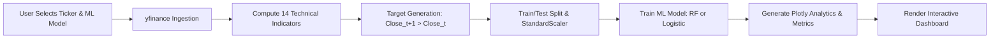

# 📈 Stock Market Classifier & Analytics Platform (`StockSenseML`)

[](https://rithan7.github.io/stock-sense-ML/)
[](https://github.com/Rithan7/stock-sense-ML)
[](https://www.python.org/)
[](https://flask.palletsprojects.com/)
[](https://scikit-learn.org/)
[](https://plotly.com/)
[](LICENSE)

An end-to-end Machine Learning web application built with **Flask**, **yfinance**, **Scikit-Learn**, and **Plotly** to predict stock market directional movement (Up vs. Down) using 14+ technical indicators, quantitative feature engineering, and interactive analytics dashboards.

---

## 🌐 Live Demo

Experience the live interactive application directly in your web browser:

👉 **[Launch StockSenseML Live Demo](https://rithan7.github.io/stock-sense-ML/)**

> **Note**: You can test stock directional predictions for major tickers like **AAPL**, **NVDA**, **TSLA**, **MSFT**, and **GOOGL**, experiment with Random Forest vs. Logistic Regression models, inspect confusion matrices and ROC curves, and search custom tickers live!

---

## ✨ Features & Capabilities

- 🔍 **Real-Time Market Data Ingestion**: Seamless integration with `yfinance` to fetch OHLCV (Open, High, Low, Close, Volume) stock price history.
- 📊 **14+ Quantitative Technical Indicators**:
  - **Moving Averages**: 5-day (MA5), 10-day (MA10), 20-day (MA20), and MA Crossover Signals.
  - **Momentum & Trend**: Relative Strength Index (RSI 14), Moving Average Convergence Divergence (MACD & Signal Line), 5-day Price Momentum.
  - **Volatility & Bands**: Bollinger Bands Width & Relative Position, Historical 5-day Volatility, Normalized Price Range.
- 🤖 **Dual Machine Learning Classification Algorithms**:
  - **Random Forest Classifier**: Non-linear ensemble model with 100 decision trees and automated Gini feature importance extraction.
  - **Logistic Regression**: Probabilistic linear classifier standardized with `StandardScaler`.
  - **Automated Threshold Tuning**: Evaluates decision thresholds from 0.05 to 0.95 to maximize F1-score.
- 📈 **Interactive Plotly Analytics Visualizations**:
  - Financial Candlestick charts overlaid with Moving Averages & Bollinger Bands.
  - RSI momentum oscillator and MACD signal crossover subplots.
  - Confusion Matrix heatmaps & ROC (Receiver Operating Characteristic) curves.
  - Feature Importance ranking bar charts for Random Forest models.
- 🔐 **User Authentication & Personal Workbench**:
  - User registration & login system secured via `Flask-Bcrypt` (password hashing) and `Flask-Login` (session state management).
  - Saved Prediction History tracking prediction targets, confidence probabilities, F1-scores, and model parameters.
  - Custom stock Watchlist for tracking favorite market symbols.

---

## 🌐 Demonstration Walkthrough

Below is an overview of how the StockSenseML platform operates:



### Key Application Screens

1. **Prediction Dashboard (`/`)**: Main workbench to select tickers, select algorithms, trigger model training, and view performance metrics & Plotly charts.
2. **Stock Search (`/search`)**: Dedicated real-time lookup tool to inspect technical indicators, prices, and technical signals for any custom stock symbol.
3. **Prediction History (`/history`)**: User dashboard displaying saved predictions, probability outputs, F1 score logs, and stock watchlist.
4. **Authentication (`/login` & `/register`)**: Secure access control for managing personalized prediction history and watchlists.

---

## 🛠️ Technology Stack

| Component | Technology | Description |
| :--- | :--- | :--- |
| **Backend Framework** | **Flask 3.0** | Python web application routing, templating, and API endpoints |
| **Machine Learning** | **Scikit-Learn** | Random Forest Classifier, Logistic Regression, `StandardScaler`, ROC/AUC, Confusion Matrix |
| **Data Ingestion & Processing** | **yfinance & Pandas** | Live market data ingestion, OHLCV processing, vector operations |
| **Interactive Visualization** | **Plotly.js** | Client-side interactive candlestick charts, subplots, ROC curves, heatmaps |
| **Database & ORM** | **SQLite & Flask-SQLAlchemy** | Relational storage for users, saved prediction history, and watchlists |
| **Security & Auth** | **Flask-Bcrypt & Flask-Login** | Password hashing (bcrypt) and session authentication management |

---

## 🔬 Mathematical Feature Engineering

The prediction engine computes 14 distinct quantitative features for binary classification, where the target is defined as:

$$
Y_t = 1 \text{ if } \text{Close}_{t+1} > \text{Close}_t, \text{ else } 0
$$

### 1. Simple Moving Averages

Unweighted rolling mean over lookback windows $N \in \{5, 10, 20\}$:

$$
\text{MA}_{N,t} = \frac{1}{N} \sum_{i=0}^{N-1} P_{t-i}
$$

### 2. Moving Average Trend Signal

Normalizes short-term (5-day) versus medium-term (10-day) trend alignment relative to current price:

$$
\text{MA\_Signal}_t = \frac{\text{MA}_{5,t} - \text{MA}_{10,t}}{P_t}
$$

### 3. Percentage Volume Variation

Day-over-day trading volume acceleration:

$$
\text{Vol\_Change}_t = \frac{V_t - V_{t-1}}{V_{t-1}}
$$

### 4. Return Volatility

Rolling 5-day sample standard deviation of percentage returns:

$$
\sigma_{5,t} = \sqrt{\frac{1}{4} \sum_{i=0}^{4} \left(R_{t-i} - \bar{R}_{5,t}\right)^2}
\qquad \text{where} \qquad
\bar{R}_{5,t} = \frac{1}{5}\sum_{i=0}^{4} R_{t-i}
$$

### 5. Relative Strength Index (RSI 14)

$$
\text{RSI} = 100 - \left( \frac{100}{1 + \dfrac{\text{EMA}(\text{Gain}, 14)}{\text{EMA}(\text{Loss}, 14)}} \right)
$$

### 6. MACD Indicator

$$
\text{MACD} = \text{EMA}(\text{Close}, 12) - \text{EMA}(\text{Close}, 26)
$$

$$
\text{MACD\_Signal} = \text{EMA}(\text{MACD}, 9)
$$

### 7. Bollinger Bands Position

$$
\text{BB\_Pos} = \frac{\text{Close} - (\text{MA}_{20} - 2\sigma)}{4\sigma + 10^{-9}}
$$

### 8. Normalized Price Range

$$
\text{Price Range} = \frac{\text{High} - \text{Low}}{\text{Close}}
$$

---

## 🚀 Quick Start Guide

### Prerequisites

- **Python 3.9+** installed on your system.
- `git` version control tool.

### 1. Clone the Repository

```bash
git clone https://github.com/Rithan7/stock-sense-ML.git
cd stock-sense-ML
```

### 2. Create and Activate Virtual Environment

**On Windows (PowerShell):**
```powershell
python -m venv venv
.\venv\Scripts\Activate.ps1
```

**On macOS/Linux:**
```bash
python3 -m venv venv
source venv/bin/activate
```

### 3. Install Dependencies

```bash
pip install -r requirements.txt
```

### 4. Configure Environment Variables

Copy `.env.example` to `.env`:

```bash
cp .env.example .env
```

*(Optional)* Customize `SECRET_KEY` and `DATABASE_URL` inside `.env`.

### 5. Run the Application Locally

```bash
python app.py
```

Open your browser and navigate to: **`http://127.0.0.1:5000`**

---

## 📁 Repository Structure

```text
stock-sense-ML/
├── app.py                # Main Flask app, feature engineering pipeline, & ML workflow
├── models.py             # Database schemas (User, Prediction, Watchlist)
├── requirements.txt      # Python dependencies (Flask, scikit-learn, yfinance, plotly)
├── .env.example          # Template environment variable configuration
├── .gitignore            # Git tracking exclusion rules
└── templates/            # HTML Jinja2 frontend templates
    ├── index.html        # Main interactive prediction workbench & Plotly dashboard
    ├── search.html        # Stock ticker search & live technical analytics view
    ├── history.html       # Saved prediction history & user watchlist manager
    ├── login.html         # User login template
    └── register.html      # User registration template
```

---

## 🤝 Contributing

Contributions, feature suggestions, and bug reports are welcome!

1. Fork the project repository.
2. Create your feature branch (`git checkout -b feature/AmazingFeature`).
3. Commit your changes (`git commit -m 'Add some AmazingFeature'`).
4. Push to the branch (`git push origin feature/AmazingFeature`).
5. Open a Pull Request.

---

## 📜 License

Distributed under the **MIT License**. See `LICENSE` for more details.
